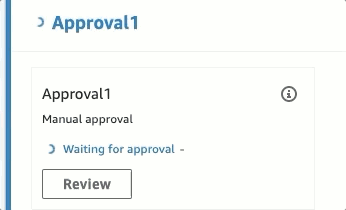
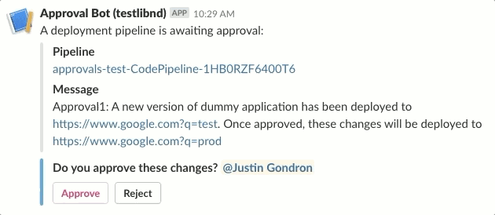

# Slack Approval Bot

Allows users to perform manual reviews of a CodePipeline deployment and approve or reject the deployment through Slack interactions.

## How it works

Let's say that you make a CodePipeline with an Approval action such as in this CloudFormation snippet:

```yaml
Name: "ManualApproval"
ActionTypeId:
  Owner: AWS
  Category: Approval
  Provider: Manual
  Version: "1"
Configuration:
  NotificationArn: !Ref MyApproversSNSTopic
  CustomData: "Approval1: A new version of dummy application has been deployed to https://www.google.com?q=test. Once approved, these changes will be deployed to https://www.google.com?q=prod"
```

The bot will subscribe to the associated approvers topic, and any time the pipeline reaches the approval action the bot will notify your Slack channel with an interactive message that can be used to approve or reject, ex:





**Note**: This bot relies upon Slack for authentication and authorization. It assumes that a user can approve/reject a deployment if they can access the channel associated with approval notification.

## How is this organized

This bot is organized into three pieces:

1. [Approval API](#approval-api) - Handles approving the associated pipeline when a user clicks the buttons in Slack. You will need one of these per [Slack app](https://api.slack.com/slack-apps) (most users will only need one per AWS Account).
1. [Channel Notifier](#channel-notifier) - Posts interactive messages to a Slack channel when associated Pipelines reach the Approval stage. You will need one of these per Slack Channel used for approvals.
1. [Pipeline Attachment](#attach-the-bot-to-a-pipeline) - Connects a CodePipeline Approval stage with a [Channel Notifier](https://console.aws.amazon.com/lambda/home#/create/app?applicationId=arn:aws:serverlessrepo:us-east-1:230391840102:applications/Slack-Approval-Bot-Notifier). You will need one of these per Pipeline per Slack Channel.

## Create your Bot

Skip this section and jump to [Attach the Bot to a Pipeline](#attach-the-bot-to-a-pipeline) if you already have a bot and just need to associate it to a new pipeline.

### Before you begin

1. Make sure you have these installed:
   - yarn and node 8.10 or greater
   - [aws-cli](https://docs.aws.amazon.com/cli/latest/userguide/cli-chap-install.html)
2. Install lambda dependencies

```console
cd slack_handler
yarn install --production
```

### Approval API

The approval API is what will handle the slack interaction. When a user clicks the approve or reject buttons, this lambda will be invoked and will handle interacting with CodePipeline to approve the changes. *You will need a separate approval api per Slack application.*

### Step 1: Create your Slack application

Before you can deploy your bot, you'll need to create your [Slack app](https://api.slack.com/slack-apps). Make a note of your application's verification token.

### Step 2: Add your Slack application secrets

Once your application is created, you'll need to share your verification token to the bot. Add the following SSM parameter keys to a path of your choice:

| Key | Description | Example Create |
|----|-----------|------ |
|verificationToken|The verification token for your Slack application. See https://api.slack.com/events-api#url_verification|aws ssm put-parameter --type 'SecureString' --name '/all/slack-approval-bot/verificationToken' --value 'myVerificationToken'|

### Step 3: Deploy the Approval API

Now that your Slack app and secrets are created, deploy this application and make sure to give it the `AppConfigPath` using the parent path from Step 2. For example, if you followed the example commands above, you would set `AppConfigPath` to `/all/slack-approval-bot`.

#### Deploy via SAR

Deploy the [Slack-Approval-Bot](https://console.aws.amazon.com/lambda/home#/create/app?applicationId=arn:aws:serverlessrepo:us-east-1:230391840102:applications/Slack-Approval-Bot) application in the repository.

#### Deploy via CLI

1. Package the approval lambda and upload it to S3

```console
aws cloudformation package \
    --template-file slack_approval.yaml \
    --output-template-file slack_approval_packaged.yaml \
    --s3-bucket my-code-bucket-name
```

2. Deploy it. Make sure you provide the same AppConfigPath that was used above when storing your Slack application secrets.

```console
aws cloudformation deploy \
  --capabilities CAPABILITY_IAM \
  --template-file slack_approval_packaged.yaml \
  --region my-region \
  --stack-name slackappname-pipeline-approval \
  --parameter-overrides AppConfigPath="/all/cd-approvals/slack"
```

### Step 4: Configure Slack to post to your API

Go to your Slack App configuration and turn on interactivity (see https://api.slack.com/messaging/interactivity#components). Populate the Request URL with `https://<approval-api-endpoint>/approval`. Ex: `https://abc123.execute-api.us-east-1.amazonaws.com/Prod/approval`.

## Channel Notifier

The notifier is what will watch your pipeline for any executions that reach the approval stage. When a new execution reaches approval, this lambda will send an interactive message to a slack channel of your choosing. *You will need a separate notifier for each Slack channel that you wish to push approval messages to.*

### Step 1: Add an Incoming Webhook for your Channel

Before your notifier can post interactive messages to Slack, you'll need to create an [Incoming Webhook](https://api.slack.com/messaging/webhooks). Make a note of the Webhook URL.

### Step 2: Add your Slack Channel secrets

Once your webhook is created, you'll need to share the Incoming Webhook URL and App's Verification Token to the notifier. Add the following SSM parameter keys to a path of your choice:

| Key | Description | Example Create |
|----|-----------|------ |
|verificationToken|The verification token for your Slack application. See https://api.slack.com/events-api#url_verification|aws ssm put-parameter --type 'SecureString' --name '/all/slack-approval-bot/verificationToken' --value 'myVerificationToken'|
|webhookUrl|The incoming webhook URL for your Slack channel. See https://api.slack.com/incoming-webhooks|aws ssm put-parameter --cli-input-json '{ "Name": "/all/slack-approval-bot/webhookUrl", "Value": "https://myWebhookUrl", "Type": "SecureString" }'|
|mentions|Additional string to use for mentions as part of the notification. Mentions will be included after the 'Do you approve these changes?' prompt. See https://api.slack.com/docs/message-formatting#linking_to_channels_and_users for more information|aws ssm put-parameter --type 'String' --name '/all/slack-approval-bot/mentions' --value '<@U024BE7LH>'|

### Step 3: Deploy the Notifier Lambda

Now that your secrets are created, deploy this application and make sure to give it the `AppConfigPath` using the parent path from Step 1. For example, if you followed the example commands above, you would set `AppConfigPath` to `/all/slack-approval-bot`.

#### Deploy via SAR

Deploy the [Channel Notifier](https://console.aws.amazon.com/lambda/home#/create/app?applicationId=arn:aws:serverlessrepo:us-east-1:230391840102:applications/Slack-Approval-Bot-Notifier) application in the repository.

#### Deploy via CLI

1. Package the notifier lambda and upload it to S3.

```console
aws cloudformation package \
    --template-file slack_channel_notifier.yaml \
    --output-template-file slack_notifier_packaged.yaml \
    --s3-bucket my-code-bucket-name
```

2. Deploy it. Make sure you provide the same AppConfigPath that was used above when storing your Slack application secrets.

```console
aws cloudformation deploy \
  --template-file slack_notifier_packaged.yaml \
  --region my-region \
  --capabilities CAPABILITY_IAM \
  --stack-name slack-channelname-notifier \
  --parameter-overrides AppConfigPath='/all/cd-approvals/slack'
```

## Attach the Bot to a Pipeline

Once your Bot is created, all that's left is to subscribe the notifier to your pipeline, and give the approval lambda permission to approve the pipeline on the user's behalf. To do this, deploy a pipeline attachment stack:

```console
aws cloudformation deploy \
  --template-file slack_pipeline_attachment.yaml \
  --region my-region \
  --capabilities CAPABILITY_IAM \
  --stack-name example-pipeline-slack-approval \
  --parameter-overrides \
    NotifyStackName='slack-channelname-notifier' \
    PipelineRegion='pipeline-region' \
    ApprovalTopicArn='arn:aws:sns:us-east-1:0123456789:appname-pipeline-Approvers1TopicABC-123'
```

## Contributing to this Bot

### Running Unit Tests

Install development dependencies and run tests:

```console
cd slack_handler
yarn install
yarn test
```

### Deploy a Test Pipeline

An example pipeline with several approval steps is provided for experimentation in the example_pipeline.yml template.

```console
aws cloudformation deploy \
  --region my-region \
  --stack-name approvals-test \
  --template-file example_pipeline.yml \
  --capabilities CAPABILITY_IAM \
  --parameter-overrides GithubOAuth=my_github_oauth
```

### Publishing to SAR

Example commands of packaging and publishing these components to SAR.

Publish the Approval API

```console
aws cloudformation package \
  --template-file slack_approval.yaml \
  --output-template-file slack_approval_packaged.yaml \
  --s3-bucket $DEPLOY_BUCKET_LIBND
sam publish --template slack_approval_packaged.yaml \
  --region us-east-1 \
  --semantic-version 1.1.2
```

Publish the Channel Notifier

```console
aws cloudformation package \
  --template-file slack_channel_notifier.yaml \
  --output-template-file slack_channel_notifier_packaged.yaml \
  --s3-bucket $DEPLOY_BUCKET_LIBND
sam publish --template slack_channel_notifier_packaged.yaml \
  --region us-east-1 \
  --semantic-version 1.1.1
```

The pipeline attachment cannot be published to SAR since it's just a template. We'll have to direct people to this repo for the template, or to [ndlib-cdk](https://github.com/ndlib/ndlib-cdk) for examples of connecting pipelines to notifiers.
